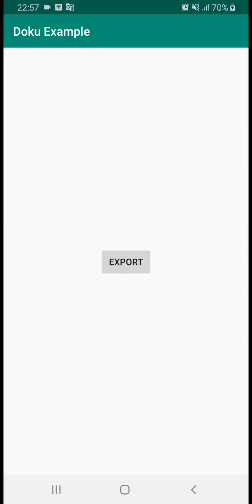

# Doku
Android library to create document from template

#### [View Releases and Changelogs](https://github.com/ekamekas/doku/releases)

[](https://circleci.com/gh/ekamekas/doku)
[](https://www.codacy.com/manual/ekamekas/doku?utm_source=github.com&amp;utm_medium=referral&amp;utm_content=ekamekas/doku&amp;utm_campaign=Badge_Grade)
[](https://jitpack.io/#ekamekas/doku)

---



## Instalation

Add jitpack repository in your root build.gradle

```gradle
allprojects {
  repositories {
    ...
    maven { url 'https://jitpack.io' }
  }
}
```

Add dependency to your app

```gradle
dependencies {
  ...
  implementation 'com.github.ekamekas:doku:${latest}'
}
```


## Usage

This is basic usage that you can do to create empty document.

```kotlin
Doku.builder(context)
  .start()
```


## Templating

Template is an abstract class that extend ContentTemplate. You have to define your XML template and data to populate

```kotlin
val content = object: ContentTemplate() {
  override fun setResource(): Int = template.xml

  override fun bindView(view: View) {
  	view.findById<TextView>(R.id.header).text = "Your data"
  }
}
```


### Header

Header template of document. Header will be draw for each pages.

```kotlin
Doku.builder(context)
  .setHeader(header: Template)
  .start()
```


### Content

Page content template. Library will handle the content so it will not overflow the page height.

```kotlin
Doku.builder(context)
  .addContent(content: Template)
  .start()
```

```kotlin
Doku.builder(context)
  .addContent(content: List<Template>)
  .start()
```


### Footer

Footer template of document. Footer will be draw for each pages.

```kotlin
Doku.builder(context)
  .setFooter(footer: Template)
  .start()
```


## Listener

You can add listener to the builder function

```kotlin
Doku.builder(context)
  .addOnSuccessListener(listener: SuccessListener)
  .addOnErrorListener(listener: ErrorListener)
  .start()
```


#### Success Listener

```kotlin
var listener = object: SuccessListener {
	override fun onSuccess(file: File) {}
}
```

File is the generated document file


#### Error Listener

```kotlin
var listener = object: ErrorListener {
	override fun onError(o_O: Exception) {}
}
```


## Document Configuration

You can modify document configuration


#### Paper Size

Paper size of the document. Paper size can be an Enum of document Size or you can define your prefered model.

```kotlin
Doku.builder(context)
  .paperSize(PaperSize.A4)
  .start()
```


#### File

Destination of generated document file

```kotlin
Doku.builder(context)
  .paperSize(File("path"))
  .start()
```


## Licence

```
Copyright 2019 Mas Eka Setiawan

Permission is hereby granted, free of charge, to any person obtaining a copy of this software and associated documentation files (the "Software"), to deal in the Software without restriction, including without limitation the rights to use, copy, modify, merge, publish, distribute, sublicense, and/or sell copies of the Software, and to permit persons to whom the Software is furnished to do so, subject to the following conditions:

The above copyright notice and this permission notice shall be included in all copies or substantial portions of the Software.

THE SOFTWARE IS PROVIDED "AS IS", WITHOUT WARRANTY OF ANY KIND, EXPRESS OR IMPLIED, INCLUDING BUT NOT LIMITED TO THE WARRANTIES OF MERCHANTABILITY, FITNESS FOR A PARTICULAR PURPOSE AND NONINFRINGEMENT. IN NO EVENT SHALL THE AUTHORS OR COPYRIGHT HOLDERS BE LIABLE FOR ANY CLAIM, DAMAGES OR OTHER LIABILITY, WHETHER IN AN ACTION OF CONTRACT, TORT OR OTHERWISE, ARISING FROM, OUT OF OR IN CONNECTION WITH THE SOFTWARE OR THE USE OR OTHER DEALINGS IN THE SOFTWARE.
```


Thanks to [Afollestad](https://github.com/afollestad/material-dialogs) for beautiful material file chooser
